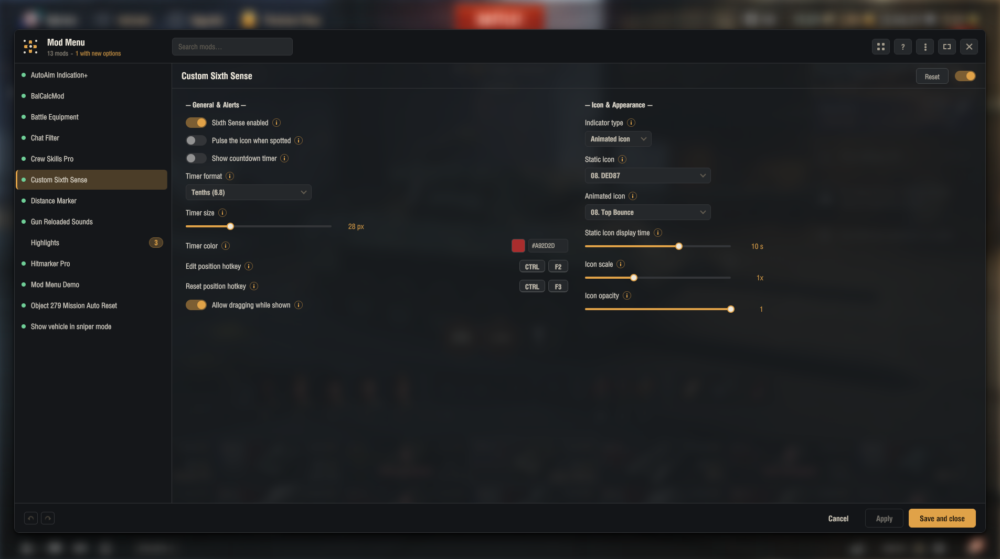

# Mod Menu

One window in the garage for the settings of the mods that use it.



Mod Menu is built for Gameface, the interface layer World of Tanks moved to. The old
Flash menu could not be moved across to it, because the two share no language, no
runtime and no drawing model, so the window, the controls and the layout engine behind
them were written from scratch for this one.

What was carried over, deliberately, is the API. Mods speak to this window in exactly
the vocabulary they already knew, so a mod written years ago opens here without a line
changed.

## What you get

* The mods that use it keep their options in one place, reachable from a button in the
  garage, rather than each hiding a panel of its own
* Search across those mods, an A to Z index for long lists, and tabs inside a mod that
  has many settings
* Apply without closing, a list of what you changed before you commit it, and undo
* The window's own look is yours: language, font, text size, panel size, accent colour,
  background colour, two or four columns, transparency, and the key that opens it
* 25 languages

## Installing

1. Download the latest `aslain.modmenu_<version>.wotmod` from
   [Releases](../../releases)
2. Put it in `World_of_Tanks/mods/<game version>/`
3. Remove any older copy of the file from that folder first, or the game loads both

Mod Menu needs the [OpenWG Gameface](https://gitlab.com/openwg/wot.gameface) loader,
version 1.1.6 or newer, which most mod packs already install. Without it the menu
says so in `python.log` and no window opens.

## Using it

The [guide](docs/guide.md) walks through the window: opening it, finding a mod, what
Apply and Cancel do, and every setting in the panel that shapes the window itself.

## Writing a mod for it

The [API guide](docs/api.md) walks through the paths most mods take, the
[full reference](docs/reference.md) lists every builder and every method, and the
[examples](examples/) are four small mods you can copy: one with two options, one with
every control type, one showing tabs, groups and conditions, and one marking options as
new.

The short version:

```python
# ask for this menu first, then whatever else provides the API
from gui.aslainMenu import g_modsSettingsApi, templates

template = {'modDisplayName': 'My Mod', 'column1': [
    templates.createCheckbox('Enabled', 'enabled', True),
], 'column2': []}

settings = g_modsSettingsApi.setModTemplate('my.mod', template, onSettingsChanged)
```

## Reporting a problem

Open an [issue](../../issues) and attach `python.log` from
`World_of_Tanks/`. Say which game version and which mods you had installed. A screenshot
of what went wrong saves a round of questions.

## License

The source in this repository, meaning the documentation, the API definitions and the
examples, is under the [MIT license](LICENSE). Copy the examples and build on them
freely.

The mod itself ships only as the built `aslain.modmenu_<version>.wotmod` attached to
each release. Passing that file on unchanged is allowed, so a mod pack may include it.
Its source is not in this repository and is not under the MIT license, which covers
only what is published here as source.

## Credits

The window is new code: the layout, the controls and everything that draws them were
written for this engine. Behind it sits the Python side, which grew out of my own
earlier work rather than starting over. What this owes to other people is worth naming
precisely.

**izeberg** defined the API in the first place, for the original mods settings window.
The vocabulary a mod speaks here is the one he chose. Keeping to it was a decision, not
an inheritance: the window could have asked mods to learn something new, and instead it
implements his interface so that nobody has to.

**Aslain** built the [enhanced Flash edition](https://github.com/Aslain/modssettingsapi)
on that foundation, and it is where most of what this window offers was designed first:
tabs, colour choices, hotkeys, live updates, images, conditions between controls, and
the translation system. Part of the Python here is that work carried forward and
extended. The window is not: Flash and Gameface share no runtime, no language and no
drawing model, so every control had to be built again from nothing against a different
set of limits.

**poliroid** wrote the mods list that many mods register themselves with. This window
does not use it and has a button and a list of its own. What it does is honour his: a mod
registered with his API is shown here as well, and where his package is not installed
this one answers in its place, so those mods keep working either way.

With both installed you get one button rather than two. Everything reachable from his is
reachable from this one, so a second button beside it would open a second list of the
same mods, and two buttons that look alike and do the same thing is how a player ends up
not knowing which one is theirs. His button is hidden, not disabled: his list, his
entries and everything registered with him carry on working, and nothing of his is
patched to do it. To keep both on screen, put this in
`mods/configs/aslainMenu.json`:

```json
{
  "hideModsListButton": false
}
```

If the file is already there, add the key inside the braces it already has.

**CHAMPi** tested this window while it was being built and shaped a fair part of it.
A good number of the features here began as his suggestions, and several others took
the form they did because he pushed back on the first attempt.
