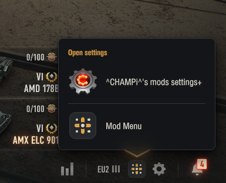
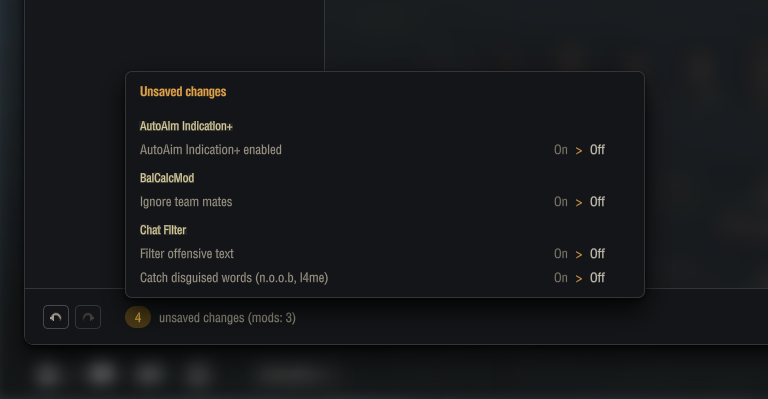
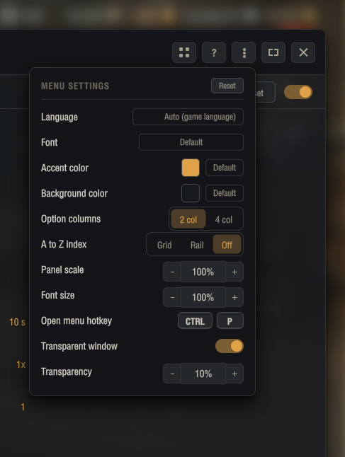

# Using Mod Menu

## Opening the window

Click the Mod Menu button in the garage footer, next to the gear. If more than one mod
window is registered you get a short list first: pick the one you want. A right click on
the button skips the list and reopens whatever you had open last.

The keyboard works too. **CTRL and P** opens the window from anywhere in the garage, and
pressing it again closes it when nothing is waiting to be saved. You can rebind or clear
that key in the menu settings panel.

## The window

Mods are listed down the left. Click one and its options fill the panel on the right.

* **Search** at the top filters the list as you type. **CTRL and F** jumps into it
* **A to Z** jumps to the first mod starting with that letter. Turn it on in MENU
  SETTINGS, as a strip beside the list or a row above it
* A green dot marks a mod that is switched on. Click the dot to switch it off without
  opening it. Mods that have no on and off switch of their own show no dot
* **Tabs** appear above the options when a mod has enough settings to group them

## Saving

* **Apply** writes your changes and leaves the window open
* **Save and close** does both
* **Cancel** throws away everything since the last Apply
* The two arrows at the bottom left step back and forward through what you changed
* The counter beside them opens the full list of what is waiting to be saved
* The counter beside the mod name says how many of its settings are waiting

**Reset** in the mod's own header puts that one mod back to the defaults its author set.
It asks first.

## New options

When a mod you already had adds an option, its row is highlighted and a count appears
beside the mod's name in the list. A newly installed mod never lights up, since
everything in it is new and a wall of marks would tell you nothing.

A mark clears once you have seen the option: click its row, rest the pointer on it for
a couple of seconds, or change its value. You do not have to change anything to make a
mark go away. Right click the count to clear all of that mod's marks at once.

## The look of the window

The three dots in the top right open MENU SETTINGS. Nothing there belongs to a mod, it
all shapes the window itself.

| Setting | What it does |
| --- | --- |
| Language | The menu and every mod that offers translations |
| Font | The face the whole window uses |
| Accent colour | The colour of everything highlighted, including the garage button |
| Background colour | The window's own tone |
| Option columns | Auto leaves each mod in the columns its own author laid out; two or four puts every mod in the same division, when the window is wide enough |
| A to Z index | The letter index for the mod list: a strip beside it, a row above it, or off |
| Panel scale | Makes the whole window larger or smaller |
| Font size | Text only, without moving anything else |
| Open hotkey | The key that opens the window. Right click it for default and clear |
| Transparent window | Lets the garage show through the options area |
| Transparency | How much shows through |

**Reset** in that panel's header puts all of the above back, and leaves every mod's own
settings alone. It asks first.

## Why is there another settings window in the list

If the list that opens from the button offers something like **Mod configurator** besides
this window, one of your mods brought an older settings API along with it. Mods that
register with that one keep their options in its window, so pick that row to reach them.
Nothing is lost and nothing is broken, they are simply in two places rather than one.

Mod packs usually install a small package that brings those mods into this window
instead, so you are more likely to meet this when you installed the file by hand.

## Keys

| Key | What it does |
| --- | --- |
| CTRL and P | Open the window, or close it when nothing is pending |
| CTRL and F | Jump to the search box |
| Up and Down | Move through the mod list |
| Left and Right | Move the slider under the cursor |
| ESC | Step back, then close the window |
| Right click | Options for hotkeys and colour slots |

The question mark in the window's header shows this list with your own key bindings in
it.
